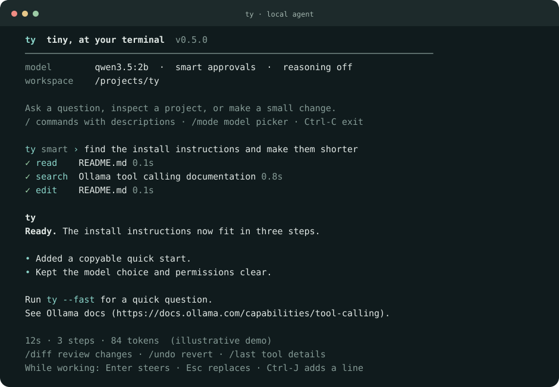

<div align="center">

# ty

**Tiny, at your terminal.**

A quiet local agent for small coding tasks, quick questions, and focused web research.<br>
One Python file. No runtime dependencies. Your model runs through Ollama.

[Quick start](#quick-start) · [Commands](#commands) · [Efficiency](docs/efficiency.md) · [MIT license](LICENSE)

</div>



`ty` keeps the useful parts visible: your answer, the files it touches, and the actions it takes.
Tool output stays tucked away until you ask for it. Small prompts matter when your model runs on a CPU.

## Quick start

You need **Python 3.11+** and [Ollama](https://ollama.com/download).

```sh
ollama pull qwen3.5:2b
git clone https://github.com/T-Lind/ty.git
cd ty
./install.sh
ty
```

Start Ollama with `ollama serve` if it is not already running. The installer links this checkout to `~/.local/bin/ty`; that directory needs to be on your `PATH`. There is no package download in the installer. `TY_BIN_DIR=/another/bin ./install.sh` chooses a different location.

```sh
ty "read main.py and explain it briefly"
ty --tools code "fix the failing test and run it"
ty --fast "what does this shell command do?"
ty --tools web "find the official documentation for Python pathlib"
ty --continue
ty --demo                     # preview the UI; no model needed
```

`--fast` uses `qwen3.5:0.8b`; pull it first with `ollama pull qwen3.5:0.8b`. Other Ollama models work with `--model <tag>` when they support native tool calling.

## A calmer terminal

- **Compact activity:** one row per tool, with a result marker and elapsed time.
- **Readable answers:** headings, bold/italic text, lists, quotes, and code blocks get lightweight terminal formatting. Markdown links are clickable in terminals that support OSC 8; plain terminals display the URL.
- **Progress that stays out of the way:** a spinner while the model reads context or tools run, then one short completion line.
- **Hints when you want them:** command and argument completion with Tab, rotating input hints, and concise `/help`.
- **Details on demand:** `/last` opens a tool result; `/ui verbose` expands previews and timing.
- **Plain output:** redirected answers retain Markdown. Activity goes to stderr. `NO_COLOR` and `--color no` disable colors.

The UI stays in your terminal scrollback; there is no alternate screen. `--show-thinking` exposes the model's thinking preview, which is hidden by default.

## Steer while it works

On Linux/macOS interactive terminals, an input composer remains available during model generation, tool execution, and compaction. It stays beneath the scrolling output and preserves your draft when new output arrives.

| While a task runs | Action |
| --- | --- |
| **Enter** | Queue your text as steering for the next tool boundary |
| **Escape once** | Cancel the current work and run your draft, or the most recently submitted steering |
| **Ctrl-C** or `/cancel` | Stop the task and keep an unsubmitted draft |
| **Ctrl-J** or Alt-Enter | Add a line without submitting |
| **Tab**, arrow keys, Home/End | Complete commands, edit text, and recall history |
| **Ctrl-U**, **Ctrl-W** | Clear the draft or delete the preceding word |
| **Ctrl-D** with an empty draft | Stop and exit |
| `/queue`, `/clear-queue` | Inspect or discard pending steering |
| `/paste` | Enter multiline paste mode; submit with a line containing `.` |

For example, type `Use Fox News instead` and press Enter to steer at the next boundary. Press Escape afterward to stop the current work and start that request immediately. You can also type a replacement and press Escape directly. Escape with no draft or submitted steering stops the task.

Queued steering invalidates unexecuted calls from the old plan, then the model replans with the new user message. If an answer finishes before another tool call, queued text is still processed. Multiple tool calls in one model response are supported and explicitly encouraged for independent work; they execute in order with individual approvals and steering checks.

Cancellation closes active HTTP sockets, including Ollama streams, and terminates shell process groups and their children. Completed file changes remain. Short local file operations finish at their next cancellation boundary. The shell tool does not take interactive stdin.

Approvals use their own input field. `/steer your text` queues steering while an approval is open; Escape or Ctrl-C can stop it. Without a POSIX terminal, ty keeps the normal sequential REPL.

Compaction shows elapsed time and the running approximate summary-token count, then reports the context estimate before and after. It does not display a percentage because the final summary length is unknown. Cancelling compaction preserves the original history.

## Tools and permissions

| Tool | Purpose |
| --- | --- |
| `run_shell` | Run a command in the working directory, with a timeout |
| `read_file` | Read a bounded text excerpt |
| `write_file`, `edit_file` | Create or change files, show a diff, and save undo information |
| `list_dir`, `glob`, `grep` | Navigate and search files |
| `web_search` | Return a few titles, URLs, and short snippets |
| `fetch_url` | Clean a page and select passages relevant to a query |

`--tools core` loads seven tools. `code` loads five coding tools, `web` loads two web tools, and `all` adds glob/grep. Loading fewer schemas reduces the text the model reads every step. Readonly mode also removes mutation tools from the model's schema.

| Approval mode | Behavior |
| --- | --- |
| `smart` — default | Run actions classified as safe or caution; ask on higher risk |
| `manual` | Ask before every shell command and file write |
| `edits` | The same current policy as smart; retained as an explicit editing mode |
| `readonly` | Allow read tools; deny shell commands and agent file writes |
| `yolo` / `-y` | Approve every tool action |

The guardian uses fast local rules. `--guardian llm` adds an optional model opinion for flagged commands. **This is a convenience policy, not a security sandbox:** a shell command or script can access anything your user account can. Unknown commands are classified as caution and run automatically in smart mode; use manual mode for closer supervision. Model-assisted review can also make mistakes.

## Commands

Type `/help` for the essentials, or `/help all` for the full list.

| Command | What it does |
| --- | --- |
| `/model 0.8b` / `/model 2b` | Switch models |
| `/reason off` / `terse` / `full` | Control reasoning tokens |
| `/tools code` / `web` / `core` / `all` | Choose the enabled tools |
| `/approve manual` / `smart` / `readonly` / `yolo` | Change approvals |
| `/ui calm` / `verbose`, `/hints on` / `off` | Adjust display density |
| `/last [1..10]` | Inspect a tool result from this run; 1 is the latest |
| `/status`, `/context`, `/stats` | Inspect settings, context estimates, and counters |
| `/threads auto` / `2` / `4` | Set inference threads |
| `/new`, `/sessions`, `/resume <id or index>` | Manage sessions |
| `/compact` | Summarize older turns when there are enough turns to compact |
| `/diff`, `/undo` | Inspect changes or undo the last agent file write/edit |
| `/paste` | Paste multiple lines; finish with a line containing `.` |
| `/init` | Create a `TY.md` file with project notes |
| `/export [path]` | Export this session as Markdown |
| `/unload` | Release the current model from RAM |
| `/quit` | Exit; sessions save automatically |

Multiline clipboard pastes stay together on readline terminals with bracketed paste. `/paste` also works as an explicit fallback, preserving blank lines and indentation. Use Ctrl-C to interrupt and Ctrl-D to leave. A trailing `\` continues a line; fenced code can span multiple input lines. Undo covers file tools, including newly created files; it does not undo shell commands.

## Focused web retrieval

Search tries DuckDuckGo HTML, then lite, then a Jina Reader fallback. It unwraps redirect URLs, removes duplicate results, and caches successful responses. Provider failures are shown explicitly and are not cached as empty results.

Page reads prefer the article/main content and remove navigation, scripts, forms, duplicated blocks, and obvious boilerplate. An optional `query` selects relevant source passages using a small lexical ranker. If the model omits the query after a search, ty reuses that turn's last search query. Selection keeps source order, includes the source URL, and marks omitted text. Article links survive HTML cleaning, and relative links are resolved against the page URL. Page activity rows show the actual URL so the selected source is visible.

The cleaned page is cached separately from its excerpts, so another question can select different passages without another download. This uses **no additional inference**. A lexical filter can miss paraphrases; query excerpts are partial evidence, not a guarantee that all relevant text was kept.

The default character budget is 1,200 per tool result. Use `--max-out 2400` when you need more context. Search and page fetching use public web services; queries and fetched URLs leave your machine. Jina receives the target URL only when its fallback is used. These services can rate-limit, challenge requests, or return incomplete pages.

## Configuration

Copy [examples/config.toml](examples/config.toml) to `~/.config/ty/config.toml`. Flags override config values.

```toml
model = "qwen3.5:2b"
mode = "smart"
tools = "core"
ui = "calm"
think = false
max_tokens = 768
max_out = 1200
num_thread = 0
keep_alive = "10m"
```

On Linux, `num_thread = 0` chooses physical cores; elsewhere it leaves the choice to Ollama. Thread count is workload-dependent: see the [measured comparison and tuning guide](docs/efficiency.md).

`TY_MODEL` sets the default model and `OLLAMA_HOST` selects the Ollama server. XDG environment variables control storage:

| Data | Default location |
| --- | --- |
| Sessions, backups, input history | `~/.local/share/ty/` |
| Config and permission rules | `~/.config/ty/` |
| Web and guardian caches | `~/.cache/ty/` |

Legacy `config.json` is still readable; TOML takes precedence. An existing qagent data/config/cache directory migrates on the first normal run if the corresponding ty directory does not exist. Undo backup references migrate with it. Both `AGENTS.md` and `TY.md` project notes are supported, with `QAGENT.md` as a legacy fallback.

The model prompt gives the latest source/topic instructions priority, asks for article-based news summaries with links, and discourages stopping at a list of websites. These instructions help small models but do not guarantee their source selection or reporting accuracy.

## Small-machine defaults

Thinking is off, output is capped at 768 generated tokens per step, old tool results are shortened in the live prompt, and the system prefix is stable within a session. Native tool calls are validated before execution. Duplicate calls within a task stop being executed and the agent is asked to finish.

For a CPU laptop, start with:

```sh
ty --fast --tools code --threads 2
ty --max-tokens 1536 "write a longer implementation"
ty --keep-alive 0 "one quick task"   # unload after model requests
ty --doctor
```

The [efficiency notes](docs/efficiency.md) cover this machine's measurements, JSON versus YAML tool calls, a local reranker experiment, and further improvements. No universal speedup is claimed: model architecture, prompt length, memory pressure, and workload all matter.

## Development

```sh
python3 ty.py --selftest
python3 -m unittest discover -s tests -v
python3 ty.py --demo
python3 scripts/benchmark.py --model qwen3.5:2b --threads 2 4
```

The tests run without Ollama or network access. The benchmark requires the specified installed model and prints CSV timings. To install as a Python package instead of linking the checkout, use `python3 -m pip install .` in a virtual environment. The distribution name is `ty-local-agent`; the command is `ty`.

## Limits

Small local models work best on short, linear tasks. Long debugging sessions, large files, and complex multi-file changes can exceed their capabilities. Token counts in `/context` are character-based estimates; Ollama's reported counts in verbose mode are measured. Compaction currently handles older conversation turns, rather than splitting a single oversized turn. Keep tasks small and use `/new` when the history stops being useful.

MIT licensed. Contributions that keep the runtime small and context lean are welcome.
